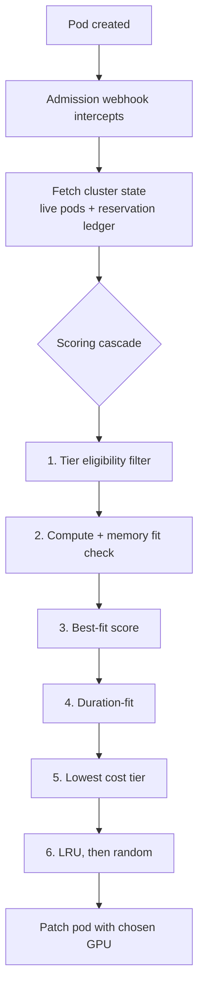

# GPU Cost-Aware Bin-Packing Scheduler

A Kubernetes scheduler that places GPU jobs more intelligently than the built-in options, by understanding GPU cost tiers and SLA requirements that standard Kubernetes ignores.

## The problem

Real GPU clusters mix hardware tiers: premium, mid, and economy GPUs, often 3-5x apart in cost. Kubernetes' built-in scheduling strategies were not built with this in mind.

Two problems show up in practice:

- **Fragmentation.** Spreading jobs evenly across GPUs (Kubernetes' default behavior) leaves every GPU partially full. No single GPU ends up with enough free capacity for the next large job, even though the cluster as a whole has room. The capacity isn't gone, it's just scattered in pieces too small to use.
- **No sense of cost or priority.** Kubernetes has no idea one GPU is expensive and another is cheap. It also has no idea that some jobs are latency-sensitive and should never land on the slowest hardware. Someone has to build that in by hand, if they build it in at all.

This project is a custom scheduler that solves both problems directly, then honestly tests how much it actually helps.

## How it works

This is a Kubernetes **mutating admission webhook**: a service Kubernetes calls automatically whenever a new pod is created, before that pod gets scheduled. The webhook reads the job's requirements (compute units, memory, latency-sensitivity, expected runtime), checks the live state of every GPU in the cluster, runs its scoring logic, then patches the pod with the GPU it should use.



The scoring cascade runs in stages, each one only used to break a tie left by the stage before it:

| Stage | What it does |
|---|---|
| 1. Tier eligibility filter | Latency-sensitive jobs are never allowed on economy-tier GPUs, enforced as a hard rule before any scoring happens |
| 2. Fit check | The GPU must have enough free compute *and* enough free memory (2D bin-packing, not compute alone) |
| 3. Best-fit score | Prefer the GPU that leaves the least combined compute + memory capacity unused, this is the core anti-fragmentation logic: tight packing keeps capacity usable instead of scattered |
| 4. Duration-fit | Short jobs go on tightly packed GPUs, long jobs go where there's more room |
| 5. Cost-tier preference | Among remaining ties, prefer the cheaper GPU tier |
| 6. Tiebreak | Least-recently-used GPU, then random |

**Setup used for testing:** 3 identical Kubernetes clusters, each with 6 simulated GPUs (2 premium, 2 mid, 2 economy). One cluster runs this webhook, the other two run Kubernetes' built-in `MostAllocated` and `LeastAllocated` strategies, so all three can be compared fairly on the same hardware.

**Race-condition safeguard:** if two jobs are submitted at the exact same moment, the webhook keeps a short-lived, in-memory record of GPUs it has just claimed, so it never double-books a GPU before Kubernetes has finished updating its own records.

## What the testing found

### 1. Packing efficiency

Ran 120 benchmarks (3 strategies, 4 load levels, 10 runs each) with realistic, randomly generated jobs.

| Load | LeastAllocated | MostAllocated | This webhook |
|---|---|---|---|
| 110% | 63.5% of jobs scheduled | 70.5% of jobs scheduled | 70.5% of jobs scheduled |

Kubernetes' `LeastAllocated` strategy consistently schedules fewer jobs than the alternative approach at every load level tested. `MostAllocated` and this webhook land in the same place here, because the webhook's extra logic only kicks in on an exact tie, and random job sizes rarely tie exactly. Full results: [`docs/RESULTS_baseline_comparison.md`](docs/RESULTS_baseline_comparison.md).

### 2. Enforcing SLA rules that Kubernetes can't

Submitted 5 latency-sensitive jobs to each scheduler, with no special handling added.

| Scheduler | Jobs that ended up on economy GPUs | What happened when there wasn't enough eligible capacity |
|---|---|---|
| Kubernetes MostAllocated | 2 of 5 (40%) | Placed the job anyway, silently breaking the rule |
| This webhook | 0 of 5 | Rejected the job instead of breaking the rule |

```
# Kubernetes MostAllocated, no extra rules added
naive-latency-1   →  economy GPU
naive-latency-2   →  economy GPU
naive-latency-3   →  mid GPU
naive-latency-4   →  mid GPU
naive-latency-5   →  premium GPU

# This webhook, same 5 jobs
webhook-latency-1  →  mid GPU
webhook-latency-2  →  mid GPU
webhook-latency-3  →  premium GPU
webhook-latency-4  →  premium GPU
webhook-latency-5  →  rejected: no eligible GPU had room
```

This is the clearest proof point in the project. Kubernetes has no built-in way to stop a job from landing on the wrong tier of hardware. This webhook makes that mistake structurally impossible.

### 3. Does the cost-preference logic actually work?

First test: ran 14 identical-sized jobs (forcing lots of ties) through all three schedulers, 5 times each. This webhook and `MostAllocated` landed on the same GPUs every time, so no difference showed up. Digging into why: both approaches naturally pack tightly, and when GPUs of the *same* tier are tied, cost preference never gets a chance to matter, since same-tier GPUs cost the same.

So a second, more targeted test: manually set up one mid-tier GPU and one economy-tier GPU to have identical leftover capacity, then submitted a job. The webhook picked the cheaper (economy) GPU every time. This confirms the cost-preference logic genuinely works, it just needs a real choice between tiers to show up, which random or same-tier workloads rarely create. Full results: [`docs/RESULTS_tiebreak_scoring.md`](docs/RESULTS_tiebreak_scoring.md).

### 4. A real concurrency bug, found and fixed

This is a classic **TOCTOU bug** ("time-of-check to time-of-use"): the webhook decided which GPUs were free by only counting pods that were already `Running`. If two jobs were submitted at almost the same time, the second one's placement decision could run against stale data, since the first pod hadn't reached `Running` yet, so its GPU claim wasn't visible.

**Fix:** the webhook now remembers a GPU claim the instant it makes a decision, not just once Kubernetes catches up. That memory clears itself automatically once the real pod shows up, with a short timeout as a backup in case something goes wrong.

```
# 4 identical jobs submitted at the exact same moment
job-0, job-1, job-2   →  same GPU (correctly packed, 9/10 capacity used)
job-3                 →  next GPU (correctly overflowed, no double-booking)
```

Ran this 3 times after the fix, same correct result every time. Before the fix, the same test reliably caused two jobs to be told to use an already-full GPU.

## Tech stack

Go, Kubernetes (client-go, admission webhooks), kind, Docker.

## Running it locally

Requires Go, Docker, `kind`, and `kubectl`.

```bash
kind create cluster --name gpu-scheduler --config deploy/kind-config.yaml
kubectl apply -f deploy/rbac.yaml -f deploy/webhook-rbac.yaml
kubectl apply -f deploy/device-plugin-daemonset.yaml
docker build -t scheduler-webhook:latest -f Dockerfile.webhook .
kind load docker-image scheduler-webhook:latest --name gpu-scheduler
kubectl apply -f deploy/scheduler-webhook.yaml -f deploy/webhook-config.yaml

kubectl apply -f test/admission-behavior/tiered-job.yaml
kubectl logs -n kube-system -l app=scheduler-webhook --tail=5
```

For the full 3-cluster benchmark setup, see `deploy/kind-config-mostallocated.yaml`, `deploy/kind-config-leastallocated.yaml`, and `run-benchmark-suite.sh`.

## Repository structure

```
cmd/
  scheduler-webhook/     the admission webhook
  benchmark/              multi-strategy benchmark runner
  aggregate/              turns benchmark output into summary tables
  device-plugin/          simulated GPU device plugin
internal/
  scheduler/              scoring logic, cluster state fetching
  clusterstate/           GPU-claim memory for the race-condition fix
  workload/               test job generators
deploy/                   cluster configs, RBAC, webhook config
test/
  admission-behavior/     single-pod webhook behavior tests
  race-condition-jobs/    concurrency stress test
  tier-preference-check/  cost-preference and SLA-eligibility tests
docs/                     detailed data behind the findings above
results/                  raw benchmark output, by experiment
```
